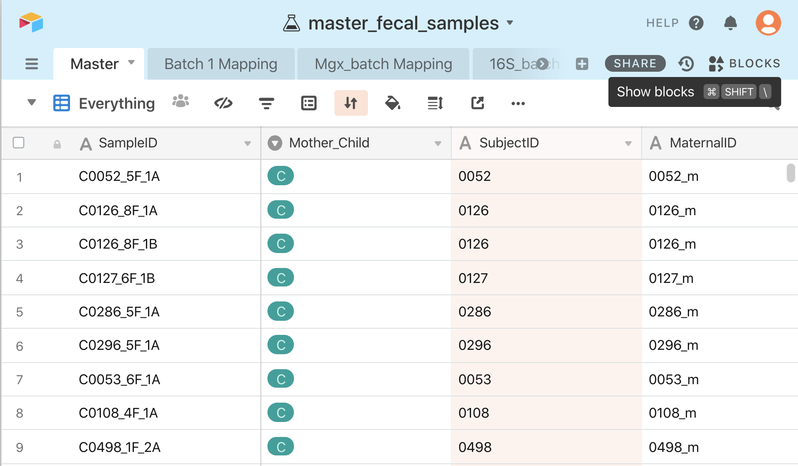
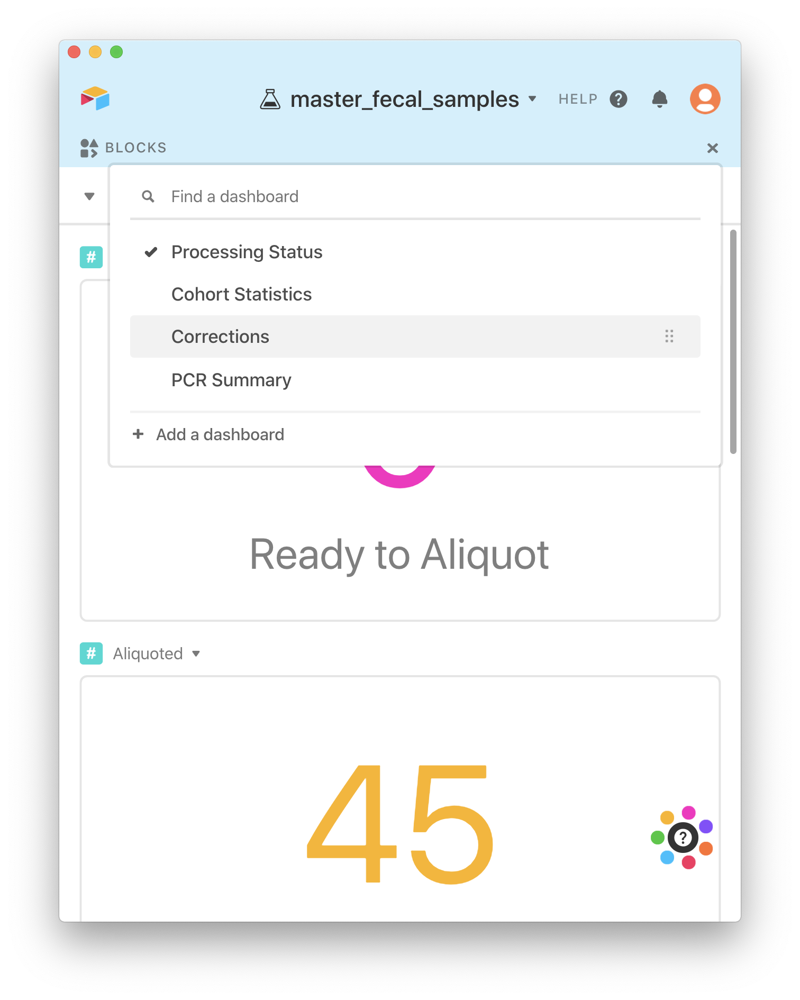
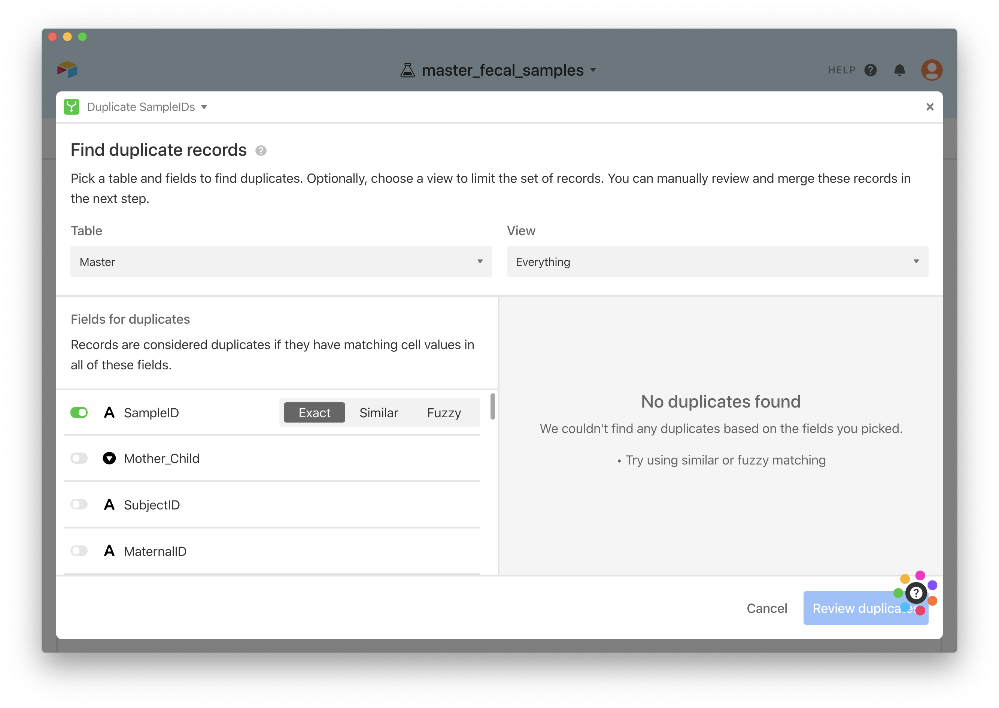
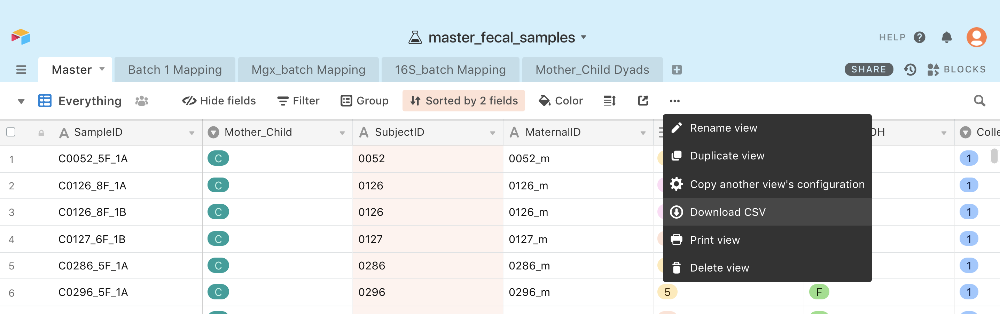

# Processing fecal samples

1. [Picking up samples](#picking-up-shipments-of-samples)
2. [Storing samples](#storing-samples)
  * [Aliquoting](#aliquoting-fecal-samples)
3. [Extracting DNA/RNA](#extracting-dna-and-rna)
4. [Sending for sequencing](#sending-for-sequencing)
5. [Updating databases](#updating-databases)

## Picking up shipments of samples

Samples should be picked up from the Advanced Baby Imaging Lab in Providence, RI
(or be delivered by someone from the ABI lab) about once a month.

*Note*: From now on, 'fecal' = OMNIgene Gut tubes for DNA/RNA,
'ethanol' = collection tubes filled with pure ethanol for metabolimics

**Advanced Baby Imaging Lab address:** _555 Prospect St, Pawtucket, RI 02860_
(~1 hr drive from Wellesley College)

### What to bring there
- [ ] Large styrofoam box
  - [ ] Dry ice (available in blue cooler on 2nd floor of L-wing)
- [ ] USB drive

### What to bring back
- [ ] Large styrofoam box
  - [ ] Dry ice
  - [ ] Fecal samples
  - [ ] Ethanol samples
- [ ] USB drive
  - [ ] Latest deidentified version of FileMaker Pro database (.fmp12 file)
  - [ ] Electronic copy of sample spreadsheets
- [ ] Fecal sample spreadsheet (with all samples included in this shipment)
- [ ] Ethanol sample spreadsheet (with all samples included in this shipment)

***

## Storing samples

All samples are stored in -80C freezer. When unloading a new shipment, all
samples should be taken out of any biomedical bags unless the sample tube
has broken. Any broken collection tubes should be disposed of in biohazardous
waste and noted in the database. To stay organized, place all samples in test
tube racks within the -80C freezer as temporary storage.

### Inputting new samples into database

(see [Updating databases](#updating-databases) section below for more information about AirTable)

Open the digital copy of the sample spreadsheets (fecal and ethanol). Copy one
spreadsheet into a new spreadsheet to reformat the information to match what is
in AirTable.

#### What is given
**Fecal with Ethanol Shipment 6/14/2019**

| Participant ID | Date of Collection | Date in -80 | Date Shipped | Notes |
|----------------|--------------------|-------------|--------------|-------|
| SD34E          | 5/9/2019 CL        | 5/12/2019 CL| 6/14/2019    | Twins (32, 34) |
| SDM1044B       | 5/2/2019 LD        | 5/15/2019 CL| 6/14/2019    | 2 wks in fridge |

#### What you want

| SampleID | Mother_Child | SubjectID | MaternalID | TimePoint | Fecal_EtOH | CollectionRep | DOC | RAInitials_DOC | DOF | RAInitials_DOF | Date_Brought_In | RAInitials_Brought | Date_Shipped | RAInitials_Shipped | Notes |
|---|---|---|---|---|---|---|---|---|---|---|---|---|---|---|---|
| C0034_5E_1A | C | 0034 | 0032_m | 5 | E | 1 | 2019-05-09 | CL | 2019-05-12 | CL |   |   | 2019-06-14 | SR | Twins (32, 34) |
| M1044_2E_1A | M | 1044 | 1044_m | 2 | E | 2019-05-02 | LD | 2019-05-15 | CL |   |   | 2019-06-14 | SR | 2 wks in fridge |

Use the `Inputting new samples` view to add new sample information into AirTable.

### Checking for duplicates

Before making labels and further processing samples, check to make sure all samples have a unique `SampleID`. This can be done using AirTable.

1. Open Airtable and toggle on `Blocks`



2. From the dropdown menu, select the `Corrections` dashboard.



3. Open the `Duplicate SampleIDs` block.



4. If there are any duplicates, email the RI group to confirm if all information, particularly `TimePoint`, is correct. If there is incorrect information, correct the relevant fields for that sample. If all information is correct, change the `CollectionRep` appropriately for any duplicate samples.


*Note*: If you do not correct duplicates prior to processing samples, make note of any changes in the `Notes` column so any discretions between labels or lab notebooks or filenames can be traced and clarified.

### Aliquoting fecal samples

All fecal samples (OMNIgene Gut tubes) should be aliquoted as these collection
tubes are not designed to be stored at -80C for long periods of time. These
samples are also aliquoted in order to set aside half of each sample for NIH.

#### Making sample labels

After inputting new samples into AirTable and generating sampleIDs
(ex: `M1020_2F_1A`), copy sampleIDs into `samplelabel_drafts.xlsx`. Drag all
sampleIDs across to fill 3 columns. Edit one column by find and replacing
"A" with "B".

You should now have 3 sample labels for each sample:
- `M1020_2F_1A`, `M1020_2F_1B` -> labels for aliquots
- `M1020_2F_1A` -> label for extracted DNA/RNA

Copy these rows of sample labels into the second sheet of the excel workbook,
formatted to fit multiple pages of labels. Each sample label page fits
5 columns x 17 rows of labels.

Then open `samplelabel_template.docx` and copy each page individually into the
template. Save each page of sample labels as `.docx` and `.pdf` file in the
format `YYYYMMDD_fecal_#`. Once ready, print each **pdf** file of labels onto
Tough Tags (Cat. No. ). Pages tend to stick to each other so load and print
each page one-by-one. Pages should be loaded label side down.
Label each printed page of labels with marker with date and #/total # pages.

```
# relevant file paths on Google Drive
My Drive/VKC LAB/Project & Personal Folders/ECHO Resonance/ECHO Sample Labels/
...
samplelabel_drafts.xlsx
samplelabel_template.docx
YYYYMMDD_fecal_#.docx
YYYYMMDD_fecal_#.pdf
```
***

#### Aliquoting Protocol
##### Materials
- [ ] 1000 ul pipette
- [ ] Wide orifice, filtered 1000 ul pipette tips
- [ ] Cryovials (1-2 ml)
- [ ] Cryoboxes
- [ ] Test tube rack
- [ ] Expandable small tube rack
- [ ] Marker
- [ ] Sample labels (see above)
- [ ] Biosafety cabinet
- [ ] Gloves
- [ ] Thermo gloves
- [ ] 70% ethanol (for sterilization)
- [ ] Paper towels
- [ ] Small biohazardous waste bag
- [ ] Ice bucket
- [ ] Ice
- [ ] Gloves

1. Turn on blower and light in biosafety cabinet and open sash. Let air flow for
3-15 mins, depending on particular model (see instructions on hood).
2. Go to 'master_fecal_samples' base on AirTable. Open 'Master' table,
'Aliquoting' view. Filter by DOC such that only 16-32 samples are shown. Print
this page for keeping track of samples and for recording all the information in
your lab notebook.
3. With full ice bucket, take selected samples out of -80C freezer. Use thermo
gloves to protect your hands from the extreme cold. Arrange in same order as
printed database page. Let defrost on ice for about 10 minutes.
4. Clean inside of biosafety cabinet with 70% ethanol. Place pipette, tips, bag of
cryovials, test tube rack, small tube rack, marker, and biohazardous waste bag in
biosafety cabinet, wiping each item with ethanol in order to sterilize.
5. Arrange two cryovials per sample in small tube rack. Label first of each pair
with SampleID.
6. Take samples out of ice and arrange in test tube rack.
7. Pipette 1000 ul of each sample into each cryovial.  
  - *Note:* this does not have to be exact. It is recommended to set pipette to
  900 ul to avoid fecal sample touching filter at top of pipette tip.
  - Shake each sample tube before aliquoting to fully homogenize.
  - Make any notes about unusual samples or inconsistencies between the fecal
  sample database and the label on the OMNIgene Gut tube.
  - If you encounter a difficult sample to pipette, here are some tips:
      - Shake sample tube vigorously until ball inside can move relatively freely.
      - Hit tube on bottom surface of the hood in order to get as much sample as
      possible to collect in bottom of the tube.
      - If sample is stuck in pipette tip, hit tip on bottom of cryovial a few times.
      This makes the sample fall down and fill in any holes that air might be escaping
      through, instead of pushing the sample.
      - Pipette sample out slowly to prevent pushing the sample to the sides of the
      tip, creating holes for air to pass through.
8. When all samples are aliquoted, put aliquots on ice. If all sample tube labels
have been double checked, they can be thrown in the biohazardous waste bag.
  - It is recommended to dispose of the biohazardous waste bag into a larger
  collection bag as it can be very smelly if left open on the bench top, even
  after being emptied.)
9. Remove all items from biosafety cabinet. Wipe down with 70% ethanol. Let vent
for 5 mins. Then close sash and turn off light and blower.
10. Label all aliquots. Put in appropriate cryoboxes, noting which boxes samples
are stored in. Store cryoboxes in the appropriate shelf in -80C freezer.
11. Update AirTable in 'Aliquoting' view with Date_Aliquoted, Number_Replicates,
RAInitials_Aliquoted, StorageBox, and any Notes.

***

### Storing ethanol samples

Ethanol samples will be processed later for metabolimics. Until that processing
begins, samples should be stored in 4" tall cryoboxes with 16 dividers. Record
StorageBox of these ethanol samples so it is easy to find them for later analysis.
The 'Ethanol storage' view is useful for this task.

***

##  Extracting DNA and RNA

### Materials
- [ ] RNeasy PowerMicrobiome Kit (*check expiration dates*)
  - [ ] PM1
  - [ ] IRS
  - [ ] PM3
  - [ ] PM4
  - [ ] PM5
  - [ ] Powerbead tubes
  - [ ] Spin filters
  - [ ] Elution tubes
- [ ] RB tubes
- [ ] Rotor adaptors
- [ ] Beta-mercaptoethanol (BME)
- [ ] 70% ethanol
- [ ] RNase Zap
- [ ] 15 ml conical tube
- [ ] 10 ml serological pipette
- [ ] Electronic pipettor
- [ ] 200 and 1000 ul pipettes
- [ ] Filtered 200 ul pipette tips
- [ ] Filtered 1000 ul pipette tips
- [ ] Wide orifice, filtered 1000 ul pipette tips
- [ ] Qiacube 1000 ul tips
- [ ] Qiacube reagent bottles
- [ ] Rotor adaptor tray
- [ ] Racks for tubes
  - [ ] Eppendorf tube racks (recommended: 4)
  - [ ] Expandable small tube rack
  - [ ] Rack for 15 ml tube
- [ ] Forceps
- [ ] Ice bucket
- [ ] Ice
- [ ] Biohazard bag
- [ ] Sharpie
- [ ] Bunsen burner
- [ ] Centrifuge
- [ ] Heat block
- [ ] PowerLyzer
- [ ] Centrifuge
- [ ] Qiacube Connect
- [ ] Chemical waste collection for BME

### Protocol
1. Turn on heat block (set to 55 degrees Celsius), centrifuge, PowerLyzer, and Qiacube
Connect. UV treat Qiacube Connect (takes 12 minutes).
  - _Note:_ Remove plastic before running UV treatment. This includes the shaker
  tube holder and the reagent rack. Pipette tips can remain in the Qiacube.
  - *DO NOT* open waste drawer while UV treatment is running.
  - Qiacube Connect login
      - User: Admin
      - Password: Admin
2. Sterilize work bench with ethanol and RNase Zap. Light bunsen burner. Remove
samples from -80 freezer and put on ice. Label top of aliquot tube with extraction number.
3. Make PM1 and beta-mercaptoethanol mixture in the 15 ml tube. Heat for 5-10 minutes
at 55 degrees Celsius.
 - *Note*: if running a full round (12 samples), use the following calculations.
 ```
 # n=12, 700 ul/n, 10 ul BME/990 ul PM1
 # BME: 84 ul
 # PM1: 8316 ul
 #     (8 ml + 316 ul)
 ```
4. While the mixture is heating, prep sample tubes (1 of each kind per sample).
Label top of tubes with number of the sample in the round (ie 1-12).
5. Load 650 ul of PM1/BME mixture into each Powerbead tube. Then add 200 ul of each
sample using wide orifice pipette tips to each respective Powerbead tube.
  - *Note*: if including a negative control, use 200 ul of PM1/BME instead of sample.
  - *Tip*: if fecal sample is stuck in pipette, pipette up and down a few times with
  PM1/BME mixture in individual Powerbead tube to loosen the sample.
6. Lyse samples on PowerLyzer 2500 speed for 45 seconds. Centrifuge for 1 minute at RT at
13,000 x g.
  - _Note:_ PowerLyzer needs to balanced 4 ways, not 2 like a centrifuge.
7. Load protocol on Qiacube Connect.
  - Should be saved on home screen as `RNA-RNeasy PowerMicrobiome-Stool or biosolid-
  IRT-12`
  - To find otherwise you can...
      1. Scan code on kit, choose `IRT`, enter elution volume and number of samples
      2. Go to `RNA` -> `RNeasy PowerMicrobiome` -> `Stool or biosolid` -> `IRT`
      and then enter elution volume, and number of samples
  - Elution volume for batch001-batch012 = 60 ul
  - Elution volume for batch013+ = **100 ul**
8. While samples are shaking and spinning, load rotor adaptors onto tray. Then place
spin columns and elution tubes into proper places on rotor adaptors (consult Qiacube for
  details).
9. Transfer 450 ul of supernatant to rotor adaptors as instructed by Qiacube.
10. Load samples and supplies into Qiacube as instructed on screen.
11. Run protocol on Qiacube Connect.
  - Make sure enough of each reagent is loaded
  - Make sure to take caps off reagent bottles and place to the side inside the Qiacube
  - Make sure waste drawer has been emptied from previous
12. When round finished, empty waste drawer into biohazardous waste. Take out reagents.
Carefully remove elution tubes from rotor adaptors and place aside. Discard of other
 tubes and plastic ware in chemical waste for beta-mercaptoethanol waste, located in
 chemical hood.
13. Ethanol inside of Qiacube and then UV treat.
  - As above, make sure to remove all hard plastics (i.e. shaker tube holder, reagent
    rack) from Qiacube before UV treatment.
14. Label extracted DNA and RNA from samples and store in proper 2" cryobox in
-80 freezer.
15. Record extraction progress and any notes from the protocol in Airtable (see [Updating
  databases] (#updating-databases) below for more details).

***

## Sending for sequencing

### Materials
**For lab**
- [ ] 96-well plate (BioRad, HSP9601)
  - With diagram of sample location in wells
- [ ] Filtered 20 or 200 ul pipettes
- [ ] 20 or 200 ul pipette
- [ ] PCR hood
- [ ] Eppendorf tube rack
- [ ] Benchtop biohazard bag
- [ ] Ice bucket(s)
- [ ] Ice
- [ ] Eppendorf tube cap opener
- [ ] 96-well plate seal (BioRad, Microseal B, MSB-1001)
- [ ] Ziploc bag


**For shipping**
- [ ] Cardboard box
- [ ] Styrofoam box
- [ ] Ice pack(s)
- [ ] FedEx international waybill
- [ ] Commercial invoice
- [ ] Shipping label
- [ ] Sample submission sheet

### Loading samples
1. Fill out submission sheet.
  - *Note*: check Integrated Microbiome Resource's [submission guidelines](https://imr.bio/submissions.html)
  for updated versions before filling out.
```$
# Submission sheet:
My Drive/VKC LAB/Sequencing Files/Sequencing Center Info/
...
IMRSampleSubmissionSheet_v11(LASTNAME_MMMDD).xlsx
```
2. Print out location of samples in the 96-well plate to refer to while loading.
3. Take out samples and put on ice in order of loading.
4. Turn on PCR hood and place new 96-well plate in work area. Put all other necessary
materials (pipette, tips, biohazard bag, rack, cap opener) in hood. UV for 10-20 mins.
5. Load samples 8 at a time, going down each column (ie A1, B1, C1, etc.). Check sampleIDs
and well location as you go.
  - *Note*: if you start with a new container of tips, you can double check your
  loading in the correct well because the tips come in the same arrangement of 8x12
  as a 96-well plate.
6. When finished, seal plate with clear adhesive seal. Run a thin tool (eg cap opener)
or fingernail between wells to ensure no cross-contamination occurs during travel.
7. Label side of plate with `VKC YourLastName MM/DD/YYYY Plate ##`
8. Put in plastic bag and label with the same information.
9. Put filled 96-well plate in -20 freezer until ready to ship.


### Shipping samples
1. Locate styrofoam box, a cardboard box the styrofoam fits into, and an ice
pack that fits into the styrofoam box with room for samples.
2. Fill out the Fed international waybill with the following address:
```
IMR (c/o Dr. André Comeau)
Dept. of Pharmacology, local 5-D
Tupper Medical Building
Dalhousie University
5850 College St.
Halifax NS B3H 4R2
```
3. Print 2 copies of address sheet and commercial invoice. Fill out date and sign
commercial invoice.
```
My Drive/VKC LAB/Sequencing Files/Sequencing Center Info/
...
IMR_commercialinvoice.pdf
IMR_ShippingLabel.pdf
```
4. Schedule FedEx pickup.
5. Pack ice pack and sample plate in styrofoam box. Place a copy of the shipping label
and commercial invoice inside cardboard box. Seal cardboard box with styrofoam
box inside. Tape shipping label to outside of box. Put international waybill and
commercial invoice in FedEx sleeve and attach to top of box.
6. Drop box off at Science Center FedEx pickup location.
  - *Note*: location is currently ground floor of Simpson East (as of Fall 2019).
7. Check that package is delivered successfully as it has sometimes gotten stuck at customs.


***

## Updating databases

The relevant database for fecal sample processing information is the
`master_fecal_samples` base on AirTable. The `Master` table, `Everything`
view is version controlled as `master_fecal_samples.csv` in the git repo
`echo_metadata` and synced across other lab storage drives
(see below for how to sync these and other files stored on these drives).

```
# relevant paths for database storage
# on personal computer, remote git repo
~/gitrepos/echo_metadata/
master_fecal_samples.csv

# lab storage drives
# "NTM"
rosalind:/Volumes/vkclab/echo/databases/
# "Franklin"
rosalind:/Volumes/franklin/echo/databases/
# "Lovelace"
ada:/lovelace/echo/databases/
...
master_fecal_samples.csv
YYYYMMDD_deidentified.fmp12
# Note: identifiable version of FileMaker Pro database CANNOT be put on NTM
YYYYMMDD_identifiable.fmp12
```

### Weekly update to `master_fecal_samples.csv`

1. Export `Master-Everything.csv` from AirTable.



2. Move `Master-Everything.csv` into gitrepos/echo_metadata/
```sh
$ cd ~/gitrepos/echo_metadata/
$ mv ~/Downloads/Master-Everything.csv ~/gitrepos/echo_metadata/master_fecal_samples.csv
```
3. Commit and push this weekly update to GitHub.
```sh
$ git status
$ git add master_fecal_samples.csv
$ git commit -m "weekly update"
$ git push
```
4. Click and drag `master_fecal_samples.csv` to `/Volumes/vkclab/echo/databases/`
to add the updated version to ntm. _Note: replace the old version on ntm,
do not keep both versions._
5. Sync ntm with rosalind and franklin.
```sh
# requires ability to ssh into rosalind and ssh into ada from rosalind
$ ssh rosalind
$ rsync -avzP /Volumes/vkclab/echo/databases/ /Volumes/franklin/echo/databases/
$ rsync -avzP /Volumes/vkclab/echo/databases/ ada:/lovelace/echo/databases/
```

***

### master_fecal_samples AirTable base overview
#### Tables
##### Master
This is the main table you will use and the one to which the others are connected.

###### Everything
This is the default view. Everything is visible and it is always sorted as such:

Sort by DOC from 1 -> 9

then by SubjectID from A -> Z

[x] Keep sorted

**If you change these settings, DO NOT FORGET to reset them as they affect the
sorting on all other views**

###### Aliquoting
Use this view when preparing to [aliquot](#aliquoting-protocol).
The default settings as follows:

Sorted same as `Everything`

Filters:
  1. Where Date_Aliquoted is empty
  2. And Fecal_EtOH is F
  3. And CollectionRep is 1

Columns shown:
    1. SampleID
      - Unique ID for this sample generated for when it is sent for sequencing.
    2. DOC
      - Date of collection
    3. Date_Aliquoted
      - When done [aliquoting](#aliquoting-protocol), filter so only the samples
      you aliquoted are selected, and then batch update the `Date_Aliquoted` to the
      correct date.
    4. Number_Replicates
      - How many aliquots are you making?
      - Should generally be 2 (A, B)
        - Older samples were divided into 4 aliquots (A, B, C, D)
    5. RAInitials_Aliquoted
      - Initials of whoever aliquoted the samples
    6. StorageBox
      - Which cryobox can the aliquots be found?
    7. Notes
      - Any miscellaneous notes

**If you edit these settings, remember to restore the view to default settings.**

###### Extracting
Use this view when prepping samples for [extractions](#extracting-dna-and-rna)

Sorted same as `Everything`

Filters:
  1. Where Date_Aliquoted is not empty
  2. And DOE is empty
  3. And Fecal_EtOH is F
  4. And CollectionRep is 1

Columns shown:
  1. SampleID
  2. Date_Aliquoted
    - Recommend hiding when printing list of samples to be extracted
  3. StorageBox
  4. DOE
  5. Extract_number
  6. Aliquot_Rep
      - Recommend hiding when printing list of samples to be extracted
  7. DNABox
  8. KitUsed
      - Recommend hiding when printing list of samples to be extracted
  9. RAInitials_Extract
      - Recommend hiding when printing list of samples to be extracted
  10. Notes

**If you edit these settings, remember to restore the view to default settings.**

###### Sequencing
Use this view when prepping to send samples for [sequencing](#sending-for-sequencing).

Sorted same as `Everything`

Filters:
  1. Where DOE is not empty
  2. And DOM is empty

Columns shown:
  1. SampleID
  2. DOC
  3. DOE
  4. Extract_number
  5. DNABox
  6. RAInitials_Extract
  7. DNAConc
  8. DOM
  9. Mgx_processed
  10. Mgx_batch
  11. Mgx_batch Mapping
  12. DO16S
  13. 16S_processed
  14. 16S_batch
  15. 16S_plate
  16. Notes

**If you edit these settings, remember to restore the view to default settings.**

###### Inputting new samples
Add new samples to the database using this view.

Filters:
  1. Where DOC is within the past 100 days
  2. Or DOC is empty

Columns shown:
  1. SampleID
  2. Mother_Child
  3. SubjectID
  4. MaternalID
  5. TimePoint
  6. Fecal_EtOH
  7. CollectionRep
  8. DOC
  9. RAInitials_DOC
  10. DOF
  11. RAInitials_DOF
  12. Date_Brought_In
  13. RAInitials_Brought
  14. Date_Shipped
  15. RAInitials_Shipped
  16. Notes

**If you edit these settings, remember to restore the view to default settings.**

###### Samples by SubjectID
Use this view for seeing how many samples are connected to each SubjectID.

Grouped by `SubjectID`

Columns shown:
  1. SampleID
  2. Mother_Child
  3. MaternalID
    - In most cases, this is the same as `SubjectID` *except in cases of __twins__*.
  4. MC_Dyads
  5. DOC
  6. Date_Aliquoted
  7. StorageBox
  8. DOE
  9. DNABox
  10. DOM
  11. Mgx_processed
  12. Mgx_batch
  13. D016S
  14. 16S_processed
  15. 16S_batch
  16. Notes

##### Batch 1 Mapping
This table is for converting batch001 sampleIDs into the current naming convention
for SampleIDs.

##### Mgx_batch Mapping
This table records which SampleIDs are in each batch sent for mgx sequencing.

##### 16S_batch Mapping
This table records which SampleIDs are in each batch sent for 16S sequencing.

##### Mother_Child Dyads

This table is to record the number of mother child pairs (or trios, in the case
of twins). This table is populated by using the `Samples by SubjectID` view and
manually adding any samples that have been sequenced from SubjectIDs that include
samples from both mothers and children.
